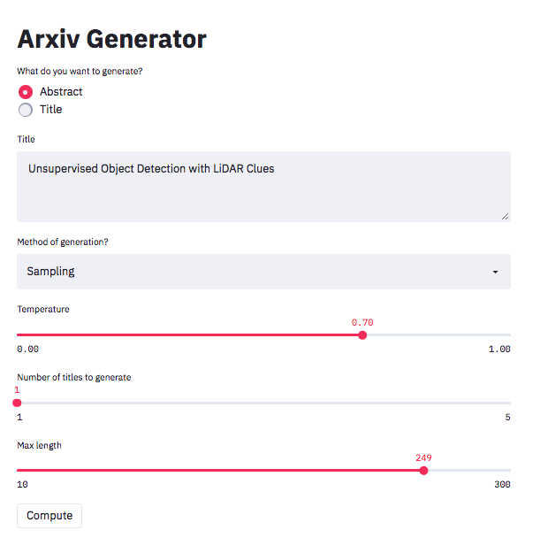

<div align="center">

<h1> Arxiv Generator </h1>

*Generating titles and abstracts using Seq2Seq Models*

</div>

### Quick Start

The fine-tuned models are available on the [Huggingface Models Hub](https://huggingface.co/), and can be loaded like any other Huggingface model,

```python
from transformers import AutoModelForSeq2SeqLM, AutoTokenizer
# for title prediction
tokenizer = AutoTokenizer.from_pretrained('pbmstrk/t5-large-arxiv-abstract-title')
model = AutoModelForSeq2SeqLM.from_pretrained('pbmstrk/t5-large-arxiv-abstract-title')

# for abstract prediction
tokenizer = AutoTokenizer.from_pretrained('pbmstrk/t5-large-arxiv-title-abstract')
model = AutoModelForSeq2SeqLM.from_pretrained('pbmstrk/t5-large-arxiv-title-abstract')
```

### Interactive Dashboard

You can also perform inference using the interactive dashboard. For this ensure that you have [streamlit](https://github.com/streamlit/streamlit) installed and run,

```bash
streamlit run app.py
```

The dashboard is then loaded.

<p align="center">
  
</p>

### Fine-tuning your own Models

To fine-tune Seq2Seq models the `finetune.py` script can be used. To install all necessary dependencies run

```bash
pip install ".[scripts]"
```

The arguments are handled using [Hydra](https://github.com/facebookresearch/hydra), and can be modified either in the config file or overwritten in the command line.

### Details

The models were fine-tuned on abstract-title pairs extracted from the [Arxiv Dataset](https://www.kaggle.com/Cornell-University/arxiv). The `arxiv_generator` module includes the ArxivDataset class to enable easier use of the dataset.
